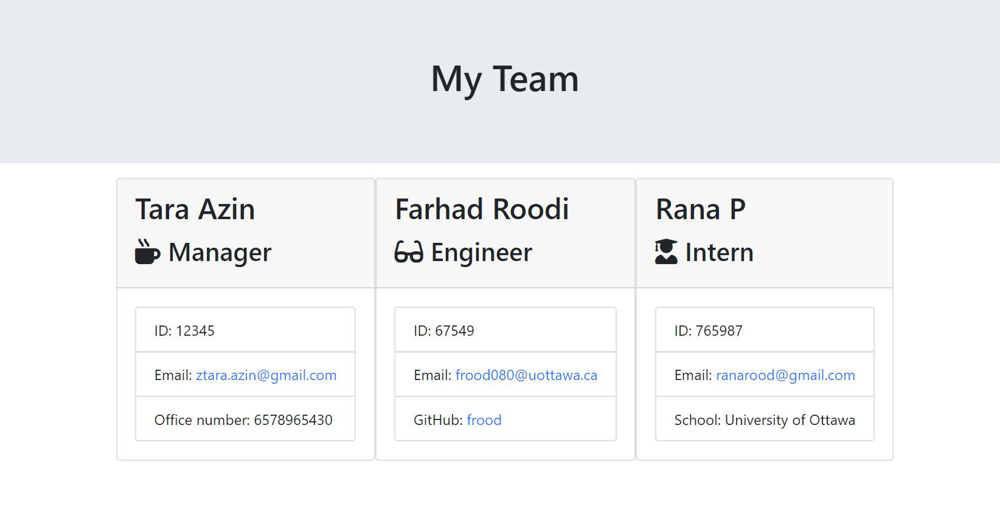

# Homework #10: Team-Profile-Generator

## Description

This is a Node CLI that takes in information about employees and generates an HTML webpage that displays summaries for each person. 

### App working example

[Video Link](https://drive.google.com/file/d/1ACN16ZtVlE6LCpo3I6FqRqkGz-EcP6DB/view?usp=sharing)

## Installation
Run:

                npm i

## Usage

This command-line application dynamically generates a HTML from a user's input. The application will be invoked with the following command:

                node app.js

The user will be prompted for their GitHub username and other information.

## Repository

- [Project Repo](https://github.com/tarazin/Team-Profile-Generator)
